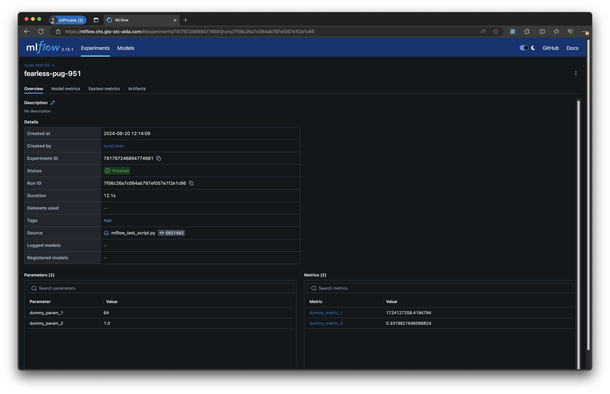
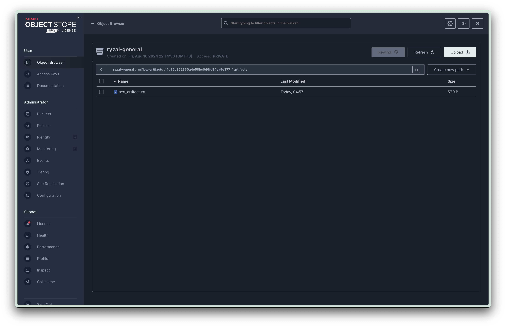

# Sample End-to-end ML Use Case

This repository is for the purpose of GTO STC AIDA's personnel having a sample end-to-end machine learning use case to refer to while testing out or experimenting with the department's cluster resources/services, be it on-premise or cloud.

## Table of Contents

- [Sample End-to-end ML Use Case](#sample-end-to-end-ml-use-case)
  - [Table of Contents](#table-of-contents)
  - [Outline \& Objectives](#outline--objectives)
  - [Environment Setup](#environment-setup)
    - [Python Virtual Environment Manager](#python-virtual-environment-manager)
    - [Credentials \& Environment Variables](#credentials--environment-variables)
    - [Test Script](#test-script)
  - [Data Processing](#data-processing)
  - [Model Training](#model-training)
  - [Batch Inferencing](#batch-inferencing)

## Outline & Objectives

This `README.md` document details out the relevant commands needed to facilitate each of the following steps:

- Environment Setup
- Data Processing
- Model Training
- Batch Inferencing

From the steps above, the following objectives are to be met:

- set up a virtual environment
- make use of a virtual environment to run scripts
- log information (metrics, parameters, etc.) and artifacts to an MLflow Tracking server
- interact with a MinIO object storage service to list out uploaded artifacts
- process raw image files (datasets) using a script
- train a computer vision machine learning model using a script
- use trained model to conduct batch inferencing on a set of image files using a script

## Environment Setup

### Python Virtual Environment Manager

Before we can execute the pipelines to follow, we have to set up the virtual environment that would contain the dependencies required by the package (and scripts) that we will be using. For this example, we will be using [`mamba`](https://mamba.readthedocs.io/en/latest). The `mamba` binary is obtained through [`microforge`](https://github.com/conda-forge/miniforge?tab=readme-ov-file#download).

> __Note:__ The set of steps below is mostly relevant for when there isn't a Python virtual environment manager present on the development workspace you are working on.

```bash
$ wget https://github.com/conda-forge/miniforge/releases/latest/download/Miniforge3-Linux-x86_64.sh
$ chmod +x Miniforge3-Linux-x86_64.sh
$ ./Miniforge3-Linux-x86_64.sh
$ ~/miniforge3/bin/mamba init bash
```

After the commands above, initiate a new shell session, and let's create the virtual environment that will in turn install the required dependencies listed within the `dependencies` folder.

```bash
$ mamba env create -f dependencies/sample-e2e-ml-use-case-conda.yaml
$ mamba activate sample-e2e-ml-use-case
```

### Credentials & Environment Variables

Most of the scripts require values (i.e. credentials) to be derived from environment variables that would be set by you. These values are unique to each user, but a sample `.env` file collating these environment variables exists in this repo that can be use as a reference, and then exported within a running shell session:

```bash
$ cp .env.example .env
```

Within the `.env` file, the following keys are listed:

```
MLFLOW_TRACKING_URI=
MLFLOW_S3_ENDPOINT_URL=
MLFLOW_TRACKING_USERNAME=
MLFLOW_TRACKING_PASSWORD=
AWS_ACCESS_KEY_ID=
AWS_SECRET_ACCESS_KEY=
```

For each of these keys, impute the values accordingly. You may obtain the relevant information from your system administrator. Once the file has been filled in with the relevant information and credentials, let's export them into the session.

```bash
$ export $(cat .env | xargs)
```

> __Important Note:__ Please do not commit any files that have been populated with sensitive information/credentials.

### Test Script

To test out whether relevant __and__ valid values have been imputed, you can make use of a test script provided.

```bash
$ python scripts/mlflow_test_script.py <NAME_OF_AN_MLFLOW_EXPERIMENT>
```

> __Note:__ Value for `<NAME_OF_AN_MLFLOW_EXPERIMENT>` can be obtained by either your team lead or the system administrator.

Once the script has been executed successfully, the following things should have happened:

- 2 parameters logged to MLflow Tracking server
- 2 metrics logged to MLflow Tracking server for 5 iterations
- A `text_artifact.txt` file containing the line `"This text content should be uploaded to the MinIO bucket."` created and logged (uploaded) to a MinIO bucket.

To observe the logged parameters and metrics, head over to the MLflow Tracking server interface.



While the dummy text artifact is viewable and downloadable through the MLflow interface, one can peruse relevant bucket which the artifact is uploaded to and observe the folder structure to better understand how MLflow handles such artifacts.



## Data Processing

Now, let's download the raw data required for this use case.

```bash
$ wget https://ryzalkdev.blob.core.windows.net/ryzal-pub-misc/mnist-pngs-data.zip -P data
# following 2 lines are for Linux systems mainly
$ sudo apt update
$ sudo apt install unzip
$ unzip data/mnist-pngs-data.zip -d data
```

Now that we have the raw data, let us run the script for processing them.

```bash
$ python scripts/process_data.py \
    process_data.raw_data_dir_path="/absolute/path/to/sample-e2e-ml-use-case/data/mnist-pngs-data" \
    process_data.processed_data_dir_path="/absolute/path/to/sample-e2e-ml-use-case/data/processed/mnist-pngs-data-processed"
```

## Model Training

```
python scripts/train_model.py \
  train_model.mlflow_exp_name=<NAME_OF_AN_MLFLOW_EXPERIMENT> \
  train_model.data_dir_path="/absolute/path/to/sample-e2e-ml-use-case/data/processed/mnist-pngs-data-processed" \
  train_model.model_checkpoint_dir_path="/absolute/path/to/sample-e2e-ml-use-case/models"
```

## Batch Inferencing

Now that we have a trained model, let's test the model out by loading it and conducting batched inferencing on a new set of unseen data. This new set of data can be downloaded like so:

```bash
$ wget https://ryzalkdev.blob.core.windows.net/ryzal-pub-misc/batched-mnist-input-data.zip -P data
$ unzip data/batched-mnist-input-data.zip -d data
```

We will now run the script to conduct batch inferencing on the new set of data. The script will load the model trained in the step above, and then iterate through the input image files, conducting model inferencing on each. The results will be written to a JSON Lines file named `batch-infer-res.jsonl` in the resulting working directory.

```bash
$ python scripts/batch_inferencing.py \
    batch_infer.model_path="/absolute/path/to/sample-e2e-ml-use-case/models/model.pt" \
    batch_infer.input_data_dir="/absolute/path/to/sample-e2e-ml-use-case/data/batched-mnist-input-data"
```

The resulting `.jsonl` file will contain the following fields for each result:

  - `time`: The time at which the result was generated, in ISO 8601 format.
  - `image_filepath`: The path to the input image file.
  - `prediction`: The class index predicted by the model.
