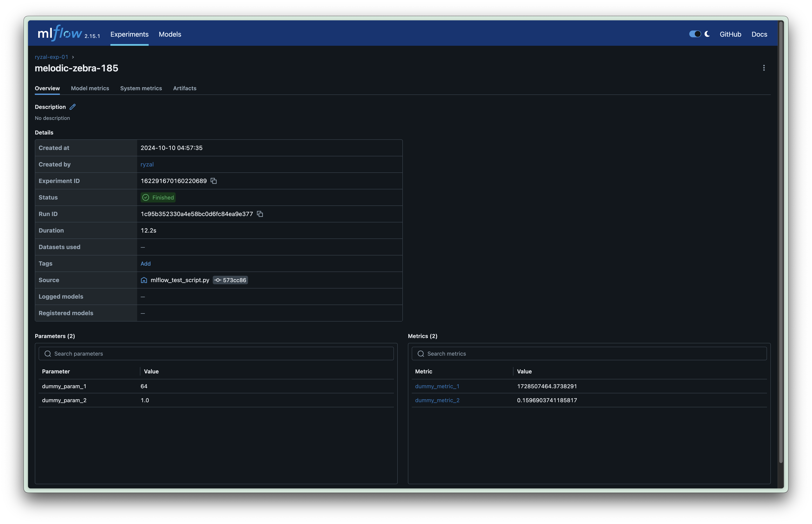

# Sample End-to-end ML Use Case

This repository is for the purpose of GTO STC AIDA's personnel having a sample end-to-end machine learning use case to refer to while testing out or experimenting with the department's cluster resources/services, be it on-premise or cloud.

## Outline

For this `README.md` document, we will be going through each of the following pipelines in steps.

- Environment Setup
- Data Processing
- Model Training
- Batch Inferencing

## Environment Setup

### Python Virtual Environment Manager

Before we can execute the pipelines to follow, we have to set up the virtual environment that would contain the dependencies required by the package (and scripts) that we will be using. For this example, we will be using [`mamba`](https://mamba.readthedocs.io/en/latest). The `mamba` binary is obtained through [`microforge`](https://github.com/conda-forge/miniforge?tab=readme-ov-file#download).

```bash
$ wget https://github.com/conda-forge/miniforge/releases/latest/download/Miniforge3-Linux-x86_64.sh
$ chmod +x Miniforge3-Linux-x86_64.sh
$ ./Miniforge3-Linux-x86_64.sh
$ ~/miniforge3/bin/mamba init bash
```

After the commands above, initiate a new shell session, and let's create the virtual environment that will in turn install the required dependencies listed within the `dependencies` folder.

```bash
$ mamba env create -f dependencies/sample-e2e-ml-use-case-conda.yaml
$ mamba activate sample-e2e-ml-use-case
```

### Credentials & Environment Variables

Most of the scripts will require values to be derived from environment variables that would be set by you. These values are unique to each users, but a sample file to collate all these environment variables and their respective values can be easily created by running the following:

```bash
$ cp .env.example .env
```

Within the `.env` file, the following keys are listed:

```
MLFLOW_TRACKING_URI=
MLFLOW_S3_ENDPOINT_URL=
MLFLOW_TRACKING_USERNAME=
MLFLOW_TRACKING_PASSWORD=
AWS_ACCESS_KEY_ID=
AWS_SECRET_ACCESS_KEY=
```

For each of these keys, impute the values accordingly. You may obtain the relevant information from your system administrator.

Once the file has been filled in with the relevant information and credentials, let's export them into the session.

```bash
$ export $(cat .env | xargs)
```

You may test the existence of the environment variables like so:

```bash
$ echo $MLFLOW_TRACKING_URI
$ echo $MLFLOW_S3_ENDPOINT_URL
$ echo $MLFLOW_TRACKING_USERNAME
$ echo $MLFLOW_TRACKING_PASSWORD
$ echo $AWS_ACCESS_KEY_ID
$ echo $AWS_SECRET_ACCESS_KEY
```

> __IMPORTANT NOTE:__ Please do not commit any files that have been populated with sensitive information/credentials.

### Test Script

To test out whether relevant __and__ valid values have been imputed, you can make use of the test script provided.

```bash
$ python scripts/mlflow_test_script.py <NAME_OF_AN_MLFLOW_EXPERIMENT>
```

__Note:__ Value for `<NAME_OF_AN_MLFLOW_EXPERIMENT>` can be obtained by either your team lead or the system administrator.

You should observe an experiment logged to your MLflow experiment, as well as an artifact under the run.



## Data Processing

Now, let's download the raw data required for this use case.

```bash
$ wget https://ryzalkdev.blob.core.windows.net/ryzal-pub-misc/mnist-pngs-data.zip -P data
# following 2 lines are for Linux users mainly
$ sudo apt update
$ sudo apt install unzip
$ unzip data/mnist-pngs-data.zip -d data
```

Now that we have the raw data, let us run the script for processing them.

```bash
$ python scripts/process_data.py \
  process_data.raw_data_dir_path="/absolute/path/to/sample-e2e-ml-use-case/data/mnist-pngs-data" \
  process_data.processed_data_dir_path="/absolute/path/to/sample-e2e-ml-use-case/data/processed/mnist-pngs-data-processed"
```

## Model Training

```
python scripts/train_model.py \
  train_model.mlflow_exp_name=<NAME_OF_AN_MLFLOW_EXPERIMENT> \
  train_model.data_dir_path="/absolute/path/to/sample-e2e-ml-use-case/data/processed/mnist-pngs-data-processed" \
  train_model.model_checkpoint_dir_path="/absolute/path/to/sample-e2e-ml-use-case/models"
```

## Batch Inferencing

Get additional data to conduct batch inferencing on:

```bash
$ wget https://ryzalkdev.blob.core.windows.net/ryzal-pub-misc/batched-mnist-input-data.zip -P data
$ unzip data/batched-mnist-input-data.zip -d data
```

Run the script to conduct batch inferencing on the data:

```bash
python scripts/batch_inferencing.py \
  batch_infer.model_path="/absolute/path/to/sample-e2e-ml-use-case/models/model.pt" \
  batch_infer.input_data_dir="/absolute/path/to/sample-e2e-ml-use-case/data/batched-mnist-input-data"
```
